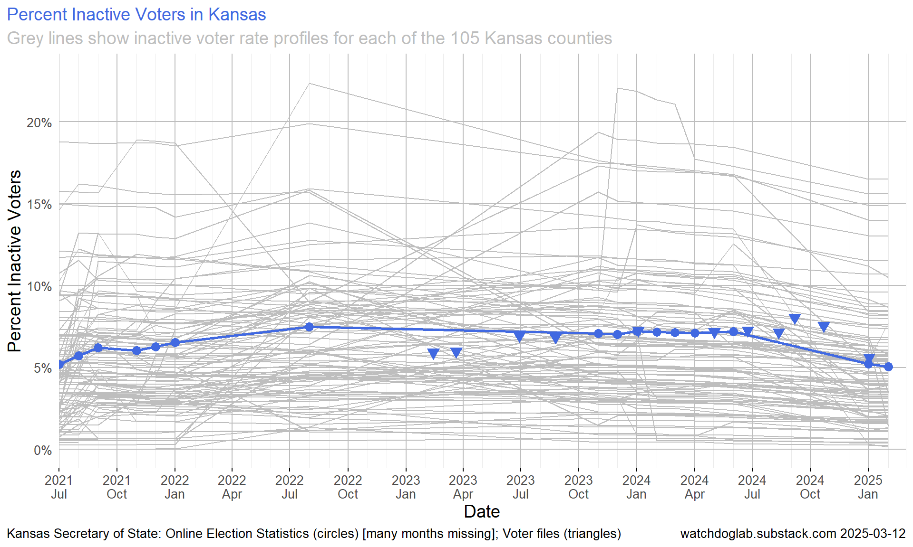
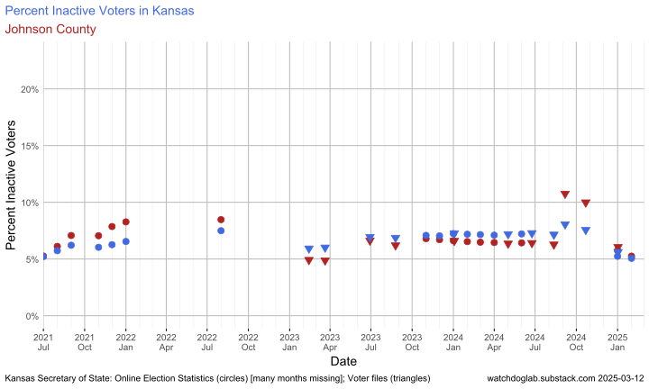
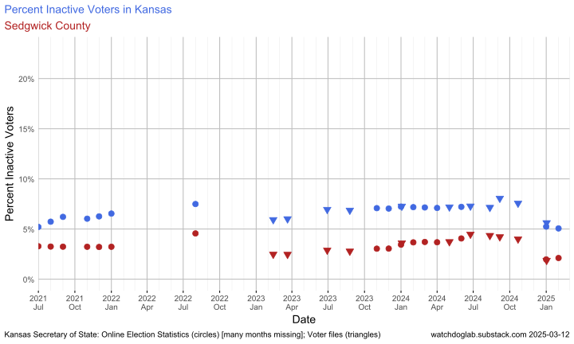
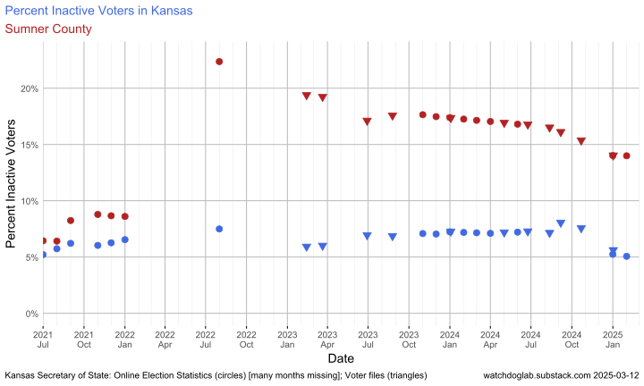
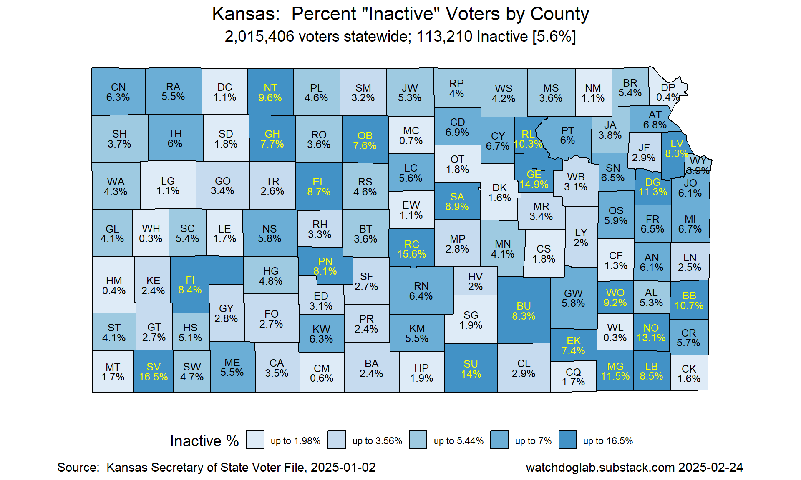

# Kansas Inactive Voter Rates

Data and plots of Kansas inactive voter rates by county (July 2021 - Feb 2025).

Includes all data files and R notebook for processing.

File `Kansas-Inactive-Voter-Rates-By-County.pdf` has page for each of 105 counties, with stateswide plot at end.

Directory `County` has separate SVG files by county.

## Kansas Inactive Voter Rate Profile

Shows 105 separate county profiles in grey

## Samples

### Johnson County

### Sedgwick County

### Sumner County

## Inactive Summary Rate Map

This map is based on the data in a Jan 2, 2025 Kansas voter registration file

# Data Source

Kansas Secretary of State "Inactive" Data: [Election Statistics Data, Voter Registration, Monthly County  Totals](https://sos.ks.gov/elections/election-statistics-data.html)

Several inconsistencies in the data files should be fixed:

* Inconsistencies in filenames across years.
  New filename format in 2025 is inconsistent with earlier years
  `2025.01.01 Percentage of Inactive Voters by County.xlsx`

* Inconsistencies in column headers across files.
  "COUNTY" was "14,464" in 2021-08-01,
               "16,022" in 2021-09-01,
               "16,000" in 2021-11-01, 2021-12-01,
               "16,027" in 2022-01-01,
               and missing  in 2022-08-01 and later

* Missing files.
  Missing monthly files by year: 2021(1), 2022(10), 2023(10), 2024(7), 2025(1)

* Lists of files on web page should be in the same order every year
